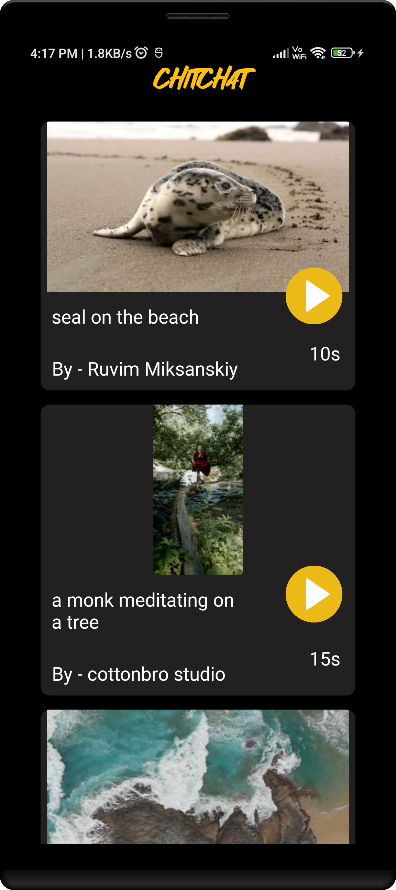

# Chitchat - Short Video Viewer

Chitchat is a mobile application that allows users to easily browse and view short videos. It provides a user-friendly interface for seamless video playback and navigation. The app leverages modern technologies and follows the MVVM architecture pattern to deliver a smooth and engaging video viewing experience.

## Screenshots




## Tech Stack & Open Source Libraries

- Kotlin
    - Lifecycle: Observe Android lifecycles and handle UI states upon the lifecycle changes.
    - ViewModel: Manages UI-related data holder and lifecycle aware. Allows data to survive configuration changes such as screen rotations.
    - DataBinding: Binds UI components in your layouts to data sources in your app using a declarative format rather than programmatically.
    - [Dagger-Hilt](https://dagger.dev/hilt/): for dependency injection.

- Architecture
    - MVVM Architecture (View - DataBinding - ViewModel - Model)
    - Repository Pattern
- [Retrofit2 & OkHttp3](https://github.com/square/retrofit): Used to fetch Video data from Pexel API.
- [Glide](https://github.com/bumptech/glide): Used for loading images for Thumbnail.
- [ExoPlayer](https://github.com/google/ExoPlayer) : Used for playing fetched videos.
- [ViewPager2](https://developer.android.com/jetpack/androidx/releases/viewpager2) - Used for smooth vertical swipping of videos.
- [Paging2](https://developer.android.com/topic/libraries/architecture/paging) - Used to load videos in paginated manner to optimize memory and network.
## Installation

Clone the repository:

```bash
git clone https://github.com/your-username/chitchat.git
```
Open the project in Android Studio.

Build and run the app on your connected device using Android Studio.

Note: Make sure you have the necessary dependencies and Android SDK installed to build and run Android apps.
## Features

- Browse through a curated list of captivating short video thumbnails.
- Tap on a thumbnail to play the corresponding video in full screen.
- Swipe vertically using ViewPager2 to seamlessly navigate through different videos.
- Enjoy the smooth and uninterrupted playback experience powered by ExoPlayer.
- Experience optimized video loading and network usage with pagination.

